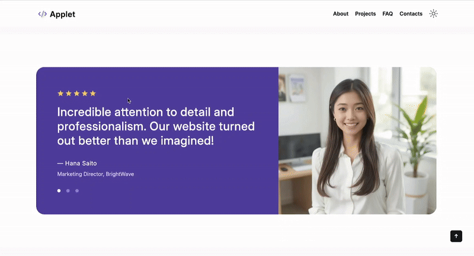

# Landing Page

Browser application called "landing-page" is a landing website for an unknown company. The website was built by following the provided designs and implementing of pixel perfect styling. It has features such as: 

+ Responsive design for desktops, tablets and smartphones,
+ Accordion for FAQ.
+ Dark and Light theme modes. Consistent during reloads.
+ "Scroll to top" button.
+ Filter for "Projects" in projects page.
+ Random "Projects" block.
+ Slider.

## Filter for "Projects" 
Filter project by "All", "Applications" and "Websites" tags


## Slider
Moves to the next silde every three seconds. When hovering freezes the state. Dots on the bottom helps to navigate within the slides.


## Installation

Open up your terminal and run this command 
```bash
git clone https://github.com/amanbolsyn/landing-page.git 
```

After cloning is finished run this command
```bash
cd landing-page/
```

There to ways of running task-planner locally
1. Running it using Live Server(VS code extension)
2. Or run this command on your terminal instead

```bash
python3 -m http.server 8000
```

Live server will open up the browser window automatically. The second way will provide you the link on your terminal that you have to follow. Unfortunately, the application doesn't work on Safari(working on it). 

Congratulations you installed my application. Hopefully you will be able to enjoy it. 

## Possible improvements 

+ Improving pixel perfect.
+ Adding animations. For example, for FAQ accordion.

## Bugs 

+ Doesn't have any bugs - at least none that I am aware of.

## Resources 

+ [Project Figma Design](https://www.figma.com/design/3Pi8gnNDhNHt2HzcpqM1hs/)
+ [Project by Alem School](https://alem.school)

## Contributing

Pull requests are welcome. For major changes, please open an issue first
to discuss what you would like to change.

## License

Cannot be used for commercial purposes.